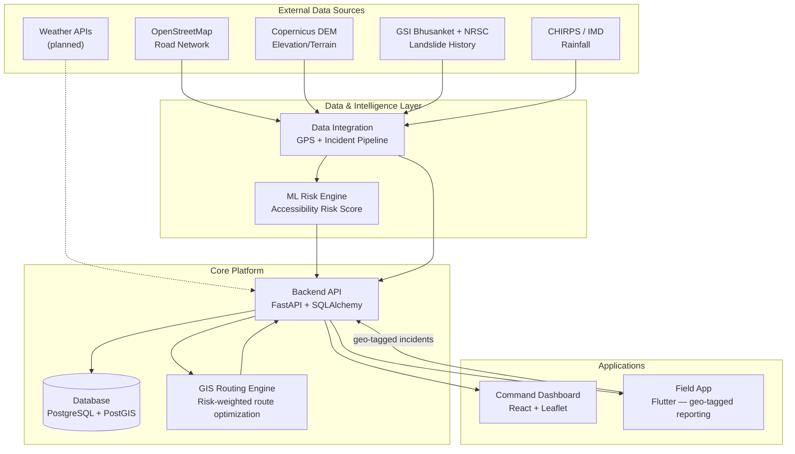

# CIVANTA : AI-Based Smart Logistics and Accessibility Intelligence Platform for NER

> An AI/ML + GIS powered platform to monitor, predict, and route around logistics disruptions across India's North Eastern Region.

**Smart India Hackathon 2026 - Problem Statement 26002**
**Organization:** Ministry of Development of North Eastern Region (MDoNER)
**Category:** Software
**Theme:** Transportation & Logistics

---

## Table of Contents

- [Problem Statement](#problem-statement)
- [The Complete Solution](#the-complete-solution)
- [System Architecture](#system-architecture)
- [Tech Stack](#tech-stack)
- [Project Structure](#project-structure)
- [Component Breakdown](#component-breakdown)
- [Data Sources](#data-sources)
- [Current Status](#current-status)
- [Getting Started](#getting-started)
- [Team](#team)

---

## Problem Statement

The North Eastern Region (NER) faces major logistics and accessibility challenges from difficult terrain, extreme weather, limited transport connectivity, and frequent disruptions caused by landslides, floods, and infrastructure gaps. Transport of essential goods - medicines, food, construction materials, agricultural produce - to remote districts is regularly delayed, driving up costs and disrupting public services. No integrated platform currently exists to give real-time logistics visibility, route accessibility status, predictive disruption alerts, and optimized transport planning for the region.

CIVANTA is our answer: an AI-enabled logistics intelligence system built specifically for NER's terrain and connectivity constraints.

---

## The Complete Solution

CIVANTA, at full scope, does the following:

1. **Monitors** real-time road, bridge, and transport accessibility across NER districts and remote locations.
2. **Predicts** route disruptions caused by landslides, floods, heavy rainfall, road damage, or traffic congestion, using a risk model trained on terrain, slope, and rainfall data.
3. **Suggests** AI-based alternate routes with estimated travel delays whenever a segment is flagged high-risk or blocked.
4. **Tracks** vehicles carrying essential commodities, medicines, agricultural produce, and construction materials via GPS.
5. **Alerts** automatically on blocked roads, inaccessible regions, delayed deliveries, and high-risk transport corridors.
6. **Enables field reporting** - local authorities and field officials upload geo-tagged updates, photos, and incident reports directly from remote locations, even offline.
7. **Visualizes** everything on a centralized command dashboard: district-wise connectivity status, logistics bottlenecks, emergency/disaster-time accessibility routes, and real-time delivery status of essential supplies.
8. **Supports** multilingual notifications and offline data synchronization, so the system works in the low-network conditions that define much of NER.

This maps directly to the PS26002 requirements (a–h) and Expected Solution bullets — every capability above corresponds to an explicit line in the official problem statement.

---

## System Architecture



---

## Tech Stack

| Layer | Technology |
|---|---|
| Frontend (dashboard) | React 19, React Router, Vite, Tailwind CSS, Leaflet, Recharts, Axios |
| Backend API | FastAPI, SQLAlchemy, Pydantic, bcrypt |
| Database | PostgreSQL + PostGIS (spatial queries, road network storage) |
| GIS / Routing | OSMnx, NetworkX, GeoPandas, Shapely, OSRM (production-scale routing) |
| ML / Risk Engine | Python, pandas, NumPy, scikit-learn |
| Field App | Flutter, Dart, GPS, Camera, local offline storage |
| Data Sources | OpenStreetMap, Overpass Turbo, Copernicus DEM, GSI Bhusanket, NRSC Landslide Atlas, CHIRPS, IMD |
| Infra (planned) | Cloud hosting, end-to-end encryption, RBAC, offline-first sync |

---

## Project Structure

```
CIVANTA/
├── README.md
│
├── intelligence-data/
│   ├── ml-risk-engine/                    # Accessibility Risk Score model
│   │   ├── data/processed/                # training input
│   │   ├── scripts/train_risk_model.py
│   │   ├── outputs/                       # trained model, scores, schema, report
│   │   ├── predict_risk_score.py          # handoff function for backend/routing
│   │   └── README.md
│   │
│   └── data-integration/                  # Road/terrain/rainfall + GPS/incident simulation
│       ├── raw_data/                      # OSM + Copernicus DEM + GSI + CHIRPS data
│       ├── scripts/                       # GPS simulation, incident pipeline, validation
│       ├── outputs/                       # simulated GPS + incidents (clearly labeled)
│       └── README.md
│
├── backend/
│   └── app/
│       ├── main.py                        # FastAPI entrypoint
│       ├── database.py                    # DB engine/session
│       ├── models.py                      # Road, RiskScore, User models
│       ├── auth.py                        # register/login/session
│       ├── roads.py                       # road data endpoints
│       ├── risk.py                        # risk score endpoints
│       ├── import_risk_data.py            # loads ML output into DB
│       └── init_db.py                     # table creation
│
│
├── gis-routing-engine/                    # Risk-weighted route optimization
│   ├── app.py                             # Streamlit prototype (OSMnx/NetworkX)
│   ├── requirements.txt
│   └── STATUS.md
│
├── dashboard-frontend/                    # Command dashboard
│   ├── src/
│   │   ├── components/                    # ui, layout, navbar, sidebar, maps, ai
│   │   ├── pages/                         # public, auth, user, admin
│   │   ├── layouts/, routes/, context/
│   │   ├── services/                      # API layer (Axios)
│   │   └── data/                          # mock data + i18n
│   ├── package.json / vite.config.js
│   └── README.md
│
└── field-app/                             # Flutter field reporting app
    └── STATUS.md
```

---

## Component Breakdown

| Component | What it does at full scope |
|---|---|
| **Data Integration** | Merges real road, terrain, elevation, and rainfall data into a single dataset keyed by `road_id`; produces GPS traces and incident reports (clearly labeled real vs. simulated) that feed the risk model. |
| **ML Risk Engine** | Scores every road segment for accessibility risk using terrain, slope, historical landslide, and rainfall features. Output consumed by both the backend and the routing engine. |
| **Backend API** | Central source of truth - serves road, risk, incident, and user data to every other component; handles auth, RBAC, and data storage. |
| **GIS Routing Engine** | Computes routes across the road network, weighting each edge by live risk score, so it can reroute around high-risk or blocked segments and estimate delays. |
| **Command Dashboard** | The operations view for district administrators - connectivity status, bottlenecks, emergency routes, delivery tracking, all on one screen. |
| **Field App** | Lets local officials and field staff report incidents (photos, geo-tag, description) from remote areas, including offline, syncing once connectivity returns. |

---

## Data Sources

| Data | Source | Used for |
|---|---|---|
| Road network | [OpenStreetMap](https://www.openstreetmap.org/) + [Overpass Turbo](https://overpass-turbo.eu/) | Road geometry, type, reference names |
| Elevation / Terrain | [OpenTopography](https://opentopography.org/) + [Copernicus DEM (AWS Open Data)](https://registry.opendata.aws/copernicus-dem/) | Elevation raster, slope |
| Historical landslides | [GSI Bhusanket](https://bhusanket.gsi.gov.in/) | Field-validated landslide inventory |
| Landslide validation | [NRSC/ISRO Landslide Atlas](https://www.nrsc.gov.in/nrscnew/resources_atlas_landslide.php) | Cross-checking GSI inventory |
| Rainfall | [CHIRPS](https://data.chc.ucsb.edu/products/CHIRPS-2.0/) + [IMD](https://mausam.imd.gov.in/) | Gridded/district precipitation |

---

## Current Status

This section exists so anyone reading this repo - teammates, mentors, judges - knows exactly what's running today versus what's designed but not yet built. It will get shorter as we build.

| Component | Status |
|---|---|
| Data Integration (road/terrain/rainfall merge, GPS + incident simulation) | ✅ Built |
| ML Risk Engine | ✅ Built |
| Backend API (FastAPI, roads/risk endpoints) | ⚠️ Partially built - SQLite, no auth enforcement yet |
| GIS Routing Engine | ⚠️ Prototype built (OSMnx/NetworkX/Streamlit) - production routing (OSRM) planned |
| Command Dashboard | ⚠️ UI built - currently running on mock data, live backend wiring in progress |
| Field App | ❌ Not started |
| PostgreSQL + PostGIS | ❌ Planned - current DB is SQLite |
| Real-time alerts, weather API integration, RBAC, offline sync | ❌ Not started |

---

## Getting Started

**Backend**
```bash
cd backend
pip install fastapi uvicorn sqlalchemy pydantic bcrypt
python -m app.init_db
uvicorn app.main:app --reload
```

**Dashboard**
```bash
cd dashboard-frontend
npm install
npm run dev
```

**GIS Routing Prototype**
```bash
cd gis-routing-engine
pip install -r requirements.txt
streamlit run app.py
```

---

## Team

**THE CODE CRUSADERS**
| ➡️ | Name | 
|---|---|
| 1 | Ayush Shaurya |
| 2 | Faiz Akhtar | 
| 3 | Harsh Kumar | 
| 4 | Rehan Ahmad | 
| 5 | Khushi Singh | 
| 6 | Anshu Kumari |

---

*Built for Smart India Hackathon 2026 - Problem Statement 26002.*
